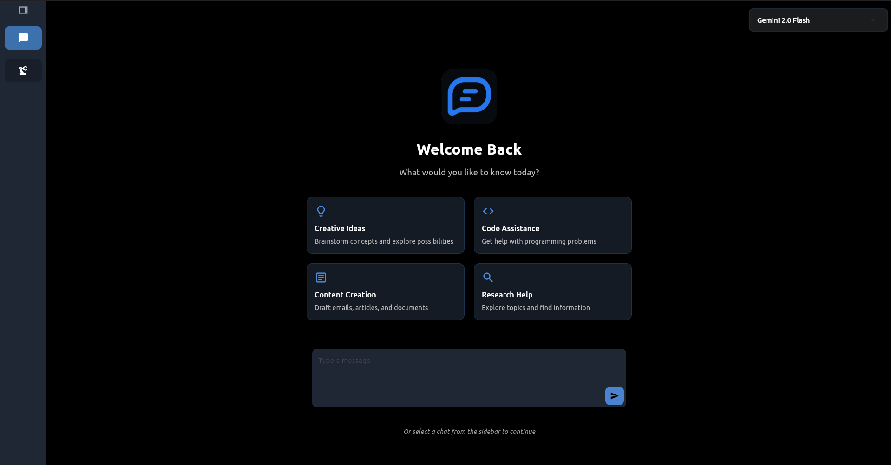

# EchoLLM

<p align="center">
  
</p>

<p align="center">
  <strong>The best AI models, all in one place.</strong>
</p>

<p align="center">
  
</p>

<p align="center">
  <a href="https://flutter.dev/"></a>
  <a href="https://dart.dev/"></a>
  
  <a href="#license"></a>
</p>

---

EchoLLM is a privacy-focused desktop client for chatting with multiple AI providers. Your API keys stay on your device — nothing is sent to third-party servers.

## Supported Models

<p>
  <a href="https://ai.google.dev/"></a>
  <a href="https://openai.com/"></a>
  <a href="https://www.anthropic.com/"></a>
  <a href="https://x.ai/"></a>
</p>

| Model | Provider | Context | Input | Output |
|-------|----------|---------|-------|--------|
| **Gemini 3 Pro** | Google / DeepMind | 1M | $2/M | $12/M |
| **Gemini 3.0 Flash** | Google / DeepMind | 1M | $0.50/M | $4/M |
| **Gemini 2.5 Pro** | Google / DeepMind | 1M | $1.20/M | $8/M |
| **Gemini 2.5 Flash** | Google / DeepMind | 1M | $0.40/M | $3/M |
| **GPT-5.2** | OpenAI | 400K | $5/M | $25/M |
| **GPT 4.1** | OpenAI | 128K | $3/M | $18/M |
| **GPT 4o** | OpenAI | 128K | $2/M | $15/M |
| **Claude Opus 4.6** | Anthropic | 1M (beta) | $5/M | $25/M |
| **Claude 4.5 Sonnet** | Anthropic | 200K | $3/M | $15/M |
| **Claude 4.0 Sonnet** | Anthropic | 400K | $4/M | $20/M |
| **Grok 3** | xAI | 512K | $0.80/M | $0.30/M |
| **Grok 3 mini** | xAI | 64K | $0.20/M | $1.50/M |
| **Grok 4 Fast** | xAI | 2M | $0.50/M | $3/M |

## Features

- **Multi-model chat** — Switch between 13 models from 4 providers in a single conversation
- **Local key management** — API keys stored securely on-device via GetStorage
- **Persistent chat history** — Conversations saved locally with Hive
- **Markdown rendering** — Full markdown support with syntax highlighting in responses
- **Configurable font size** — Adjust text scale from 80% to 150%
- **Send on Enter** — Toggle Enter-to-send behavior
- **Model browser** — View model details including context window, pricing, and capabilities

## Getting Started

### Prerequisites

- [Flutter SDK](https://docs.flutter.dev/get-started/install) (3.6+)
- API key from at least one supported provider

### Run from source

```bash
git clone https://github.com/thatlinuxguyyouknow/EchoLLM.git
cd EchoLLM
flutter pub get
flutter run -d linux    # or macos, windows
```

### Install from Snap

```bash
snap install echollm
```

## Tech Stack

| | |
|---|---|
| **State Management** | Provider |
| **Local Storage** | Hive (chat history), GetStorage (preferences & keys) |
| **Markdown** | flutter_markdown |
| **Fonts** | Google Fonts (Ubuntu) |
| **HTTP** | http package |


## License

Apache-2.0
